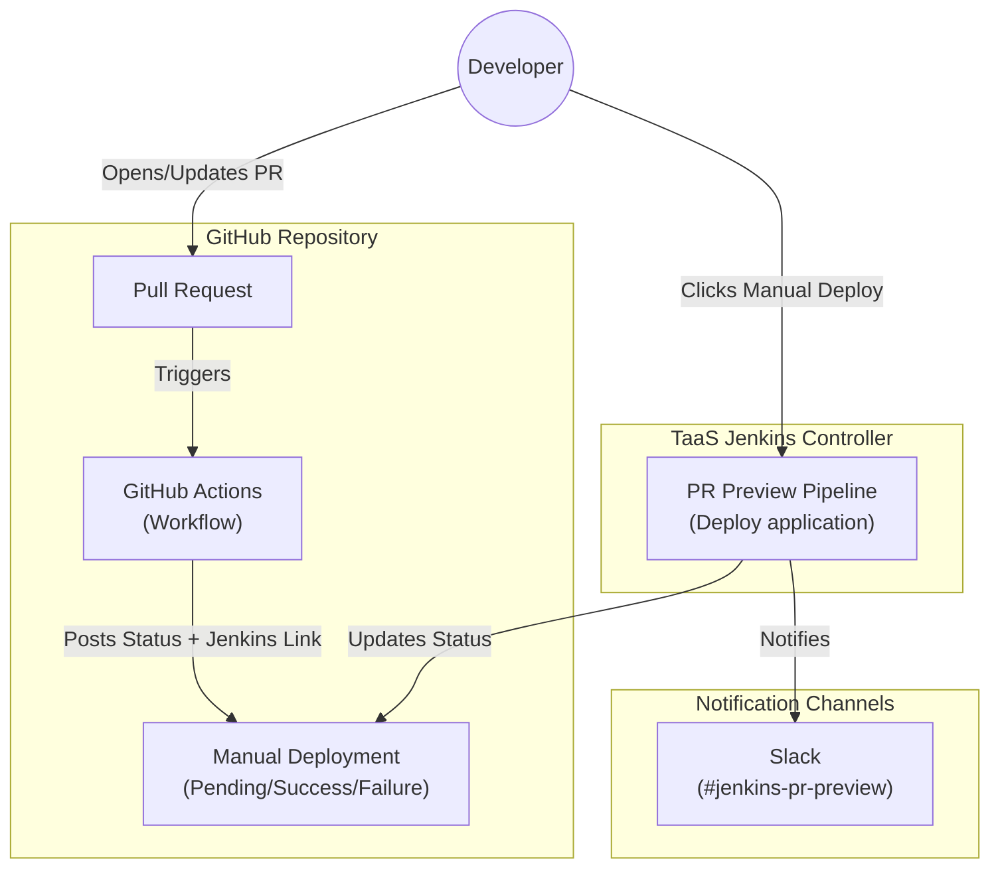

# Design Proposal: PR Preview Deployment System

**Subject:** Automated Pull Request Preview Environments for AI Services

**Target Platform:** GitHub Actions + Jenkins (TaaS)

**Status:** Draft / Proposal

---

## 1. Executive Summary

The **PR Preview Deployment System** provides an automated, on-demand infrastructure for validating pull requests through ephemeral preview environments. By integrating GitHub Actions with Jenkins pipelines, the system enables developers to deploy temporary AI application instances directly from pull requests, receive live chatbot URLs, and validate changes in isolated environments before merging. This architecture eliminates manual deployment overhead, accelerates the review cycle, and ensures code quality through real-world testing.

## 2. System Architecture

The architecture integrates GitHub's event-driven workflow system with Jenkins' robust pipeline orchestration, creating a secure bridge between source control and deployment infrastructure.

* **GitHub Actions (Event Trigger)**: Listens to pull request events and posts deployment entry points as commit statuses, providing a seamless developer experience within the GitHub UI.
* **Jenkins Pipeline (Orchestrator)**: Executes the complete deployment lifecycle including code checkout, image building, application deployment, and environment cleanup on a dedicated RHEL agent.
* **Notification Layer**: Delivers real-time status updates to GitHub commit statuses and Slack channels for comprehensive observability.
* **Handle multiple PR**: When a developer triggers a PR preview deployment while another PR's deployment is already running, Jenkins automatically queues the new build request and waits for the previous job to complete. Once the queue is clear, Jenkins initiates the deployment for the next PR in sequence. We have used `Do not allow concurrent builds` option in Jenkins to ensure that only one deployment is running at a time.



## 3. Core Functional Capabilities

The PR Preview system transforms the pull request validation workflow into an automated, self-service process:

* **On-Demand Deployment**: Developers trigger preview deployments manually through a Jenkins link embedded in GitHub commit statuses, ensuring controlled resource utilization.

* **Ephemeral Environments**: Creates isolated, time-bounded application instances, which can be used for testing. 

* **Real-Time Observability**: Provides live deployment status through GitHub commit checks and Slack notifications, including chatbot URLs and deployment logs.

* **Automatic Cleanup**: Enforces a 2-hour testing window with automatic environment teardown, ensuring efficient resource management and preventing orphaned deployments.

## 4. Security Framework

Security is enforced through multiple layers of authentication and access control, ensuring only authorized personnel can trigger deployments.

* **GitHub App Authentication**: Utilizes short-lived JWT tokens and installation-specific access tokens for secure GitHub API interactions.
* **TaaS Access Control**: Restricts Jenkins access to a fixed whitelist of IBMers.
* **Credential Management**: Stores sensitive credentials (Slack tokens, GitHub App keys, Jenkins API credentials) in Jenkins' encrypted credential store.
* **Code Review Requirement**: Developers must manually review PR code for vulnerabilities before triggering deployments, preventing malicious code execution.


### GitHub App Configuration

The GitHub App provides programmatic access to the repository for status updates:

1. **Installation**: The app must be installed in the `project-ai-services` repository with the following permissions:
   - **Read access**: Code and metadata
   - **Read and write access**: Commit statuses

2. **Authentication Flow**:
   - Jenkins generates a JWT using the GitHub App ID and private key
   - Exchanges JWT for an installation-specific access token
   - Uses the access token to post commit statuses to pull requests

## 5. Workflow Execution

The PR Preview system operates through a two-phase workflow: GitHub Actions triggers the entry point, and Jenkins executes the deployment pipeline.

### Phase 1: GitHub Actions Trigger

When a pull request is opened or reopened, GitHub Actions automatically executes:

```yaml
# Trigger: pull_request_target (opened/reopened)
# Security: Uses pull_request_target to write statuses without executing PR code
```

**Execution Steps:**
1. **Extract PR Metadata**: Captures PR number, commit SHA, and repository context
2. **Construct Jenkins URL**: Builds a parameterized Jenkins job URL with encoded parameters:
   - `CHECKOUT`: PR number
   - `DEPLOY_APP`: auto (automatic detection)
   - `updateGitStatus`: true (enables GitHub status updates)
3. **Post Commit Status**: Creates a pending status check with the Jenkins URL as the target, allowing developers to manually initiate deployment

### Phase 2: Jenkins Pipeline Execution

The Jenkins pipeline orchestrates the complete deployment lifecycle. Developer manual intervention is required to start the deployment process.

## 6. Jenkins pipeline Stages Detail

### 6.1 Resolve Commit SHA

When `updateGitStatus` is enabled, Jenkins resolves the full commit SHA from the PR number using `git ls-remote`. This SHA is used for all subsequent GitHub status updates to ensure accuracy.

### 6.2 Pre-Steps & Queue Poller

The queue poller is a background process that monitors the Jenkins build queue for duplicate builds targeting the same PR. If detected, it aborts the older build to prevent resource conflicts.

### 6.3 GitHub App Diagnostics (Optional)

Verifies GitHub App connectivity by:
1. Generating a JWT from the App ID and private key
2. Resolving the installation ID for the repository
3. Probing repository access permissions

### 6.4 Checkout Code

Clones the `project-ai-services` repository and checks out the PR branch using `refs/pull/<PR>/head` reference, ensuring the latest PR code is deployed.

### 6.5 Detect Modified Application (Auto Mode)

When `DEPLOY_APP` is set to `auto`, Jenkins analyzes the git diff between `origin/main` and `HEAD` to identify modified files. Currently supports automatic detection for the `rag-dev` application.

### 6.6 Build Container Images

Conditionally rebuilds container images based on modified directories:

* **RAG UI Image**: Rebuilt if `spyre-rag/ui` contains changes
* **RAG Backend Image**: Rebuilt if `spyre-rag/src` contains changes

After building, the pipeline updates `values.yaml` using `yq` to reference the new local image tags.

### 6.7 Build AI Services Binary

Executes `make bin` in the `ai-services` directory to compile the Go binary, ensuring the latest CLI version is used for deployment.

### 6.8 Delete Existing CICD Application

Removes any previously deployed applications from prior Jenkins runs, ensuring a clean deployment environment.

### 6.9 Deploy Application

Creates a new application instance using the `ai-services` CLI.

### 6.10 Ingest Documents

Prepares the application for testing by:
1. Copying predefined PDF documents into the application's docs directory
2. Starting the ingestion pod using the `ai-services` CLI
3. Waiting for ingestion completion

### 6.11 Notify Success & Publish URL

Posts deployment success notifications to:
* **GitHub**: Updates commit status to `success` with deployment details
* **Slack**: Sends message to `#jenkins-pr-preview` channel with chatbot URL and host IP

### 6.12 Wait for Manual Testing

Jenkins enters a wait loop (maximum 2 hours) to allow developers to test the preview deployment. The loop checks every 5 minutes if the application still exists. If manually deleted, the pipeline exits early.

### 6.13 Cleanup (Always)

Executes in the `post` section of the pipeline, ensuring cleanup occurs regardless of success or failure:
* Deletes the CICD application
* Posts failure/abort status to GitHub and Slack if applicable

## 7. Notifications & Observability

The system provides comprehensive visibility into deployment status through multiple channels:

### GitHub Commit Statuses

* **Pending**: "Manual Deployment" link posted when PR is opened
* **Pending**: "Deployment Started" when Jenkins pipeline begins
* **Success**: "Deployment Successful" with chatbot URL
* **Failure**: "Deployment Failed" with error details
* **Aborted**: "Deployment Aborted" if manually cancelled

### Slack Notifications

All notifications are sent to `#jenkins-pr-preview` channel:

* **Success**: Includes chatbot URL, host IP, PR number, and Jenkins build link
* **Failure**: Includes error summary, PR number, and Jenkins build link
* **Abort**: Includes abort reason, PR number, and Jenkins build link
